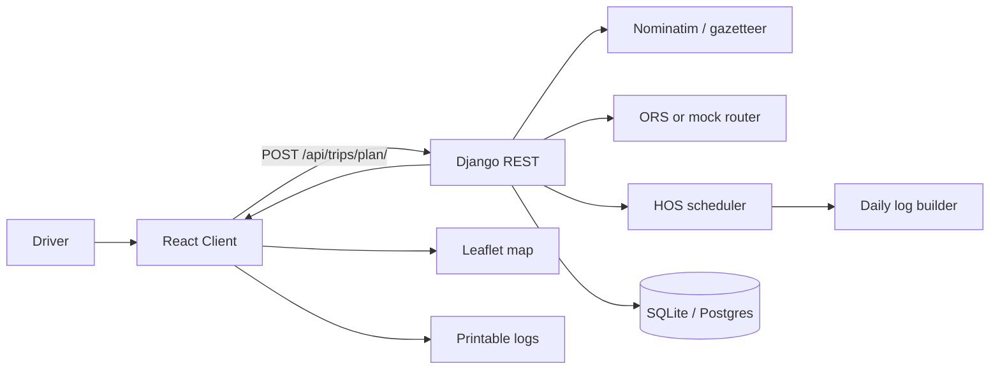

# HOS Trip Planner — Architecture

## Purpose
Full-stack assessment app that accepts a driver’s **current / pickup / dropoff** locations and **current cycle hours used**, then returns:

1. A routed map with stops and rests  
2. Route instructions  
3. One or more filled **Drivers Daily Log (24 hours)** sheets  

Built for a **property-carrying** driver on the **70-hour / 8-day** cycle, matching the assignment assumptions (no adverse conditions).

## Stack
| Layer | Choice | Why |
|---|---|---|
| Frontend | React + TypeScript + Vite | Fast DX, typed UI, easy Vercel deploy |
| Forms / data | React Hook Form + Zod + TanStack Query | Validated inputs and mutation state |
| Maps | Leaflet + OSM tiles | Free, no API key for basemap |
| Backend | Django + Django REST Framework | Required by the brief; clean service layer |
| Routing | Nominatim geocode + OpenRouteService (optional) | Free map/directions APIs; mock fallback without a key |
| DB | SQLite (local) / Postgres (prod via `DATABASE_URL`) | Simple local, standard hosted |
| Deploy | Vercel (frontend) + Render/Railway (API) | Static SPA + long-running Django |

## High-level flow



## Backend layout
- [`trips/models.py`](trips/models.py) — `TripPlan` persists inputs + immutable results  
- [`trips/serializers.py`](trips/serializers.py) — request validation (locations, cycle 0–70)  
- [`trips/services/routing.py`](trips/services/routing.py) — geocode + directions  
- [`trips/services/hos.py`](trips/services/hos.py) — deterministic HOS itinerary engine  
- [`trips/services/logs.py`](trips/services/logs.py) — 24-hour sheet segments / remarks / totals  
- [`trips/views.py`](trips/views.py) — `POST /api/trips/plan/`, `GET /api/trips/{id}/`, health  

### API contract
`POST /api/trips/plan/`

```json
{
  "currentLocation": "Chicago, IL",
  "pickupLocation": "Dallas, TX",
  "dropoffLocation": "Atlanta, GA",
  "currentCycleUsedHours": 12,
  "shiftStart": "2026-03-01T06:00:00Z"
}
```

Response includes `tripId`, `route` (geometry, legs, maneuvers, waypoints), `itinerary` (timestamped events with before/after clocks), `compliance`, and `logs[]` (one per calendar day, each totaling 24 hours).

## HOS policy (modeled)
In scope:
- **11-hour** driving limit  
- **14-hour** driving window  
- **30-minute** break after **8** cumulative driving hours  
- **10-hour** off-duty reset (restores 11/14; does **not** reset cycle)  
- **70-hour / 8-day** cycle tracked from `currentCycleUsedHours`  
- Fuel at least every **1,000 miles** (30 min on-duty)  
- **1 hour** on-duty pickup and **1 hour** on-duty dropoff  

Out of scope (explicitly):
- Sleeper-berth split / passenger-seat combinations  
- Short-haul / 16-hour exceptions  
- Adverse driving conditions  
- Automatic 34-hour restart insertion  
- Reconstructing prior 7 days of historical logs beyond the starting cycle total  

If a trip cannot be finished under these rules (e.g. cycle exhausted), the API returns **422** with a clear message instead of inventing a non-compliant log.

### Scheduling algorithm (summary)
1. Open the duty day at `shiftStart`.  
2. Drive current → pickup (skip if ~0 miles).  
3. 1 hour on-duty pickup.  
4. Drive pickup → dropoff, splitting whenever the earliest of these binds: remaining drive, window, time until 30-min break, miles until fuel, or remaining cycle.  
5. Insert break, fuel, or 10-hour reset as required.  
6. 1 hour on-duty dropoff.  
7. Clip duty segments into calendar days; pad off-duty so each sheet totals **24.00** hours.

## Frontend layout
- [`frontend/src/components/TripForm.tsx`](frontend/src/components/TripForm.tsx) — validated inputs + sample trip  
- [`frontend/src/components/RouteMap.tsx`](frontend/src/components/RouteMap.tsx) — route polyline + role markers  
- [`frontend/src/components/Itinerary.tsx`](frontend/src/components/Itinerary.tsx) — compliance stats + stop timeline  
- [`frontend/src/components/DailyLogSheets.tsx`](frontend/src/components/DailyLogSheets.tsx) — SVG graph grid matching the paper log template, print CSS  

The UI **never** reimplements HOS math; it only renders API output.

## Testing
- Unit: break after 8h drive, 11h reset, fuel ≥1000 mi, cycle exhaustion, daily totals = 24  
- API: validation, create + retrieve with mocked geocode  
Run: `pytest trips/tests/`

## Deployment topology
- **Frontend (Vercel):** build `frontend/`, env `VITE_API_BASE_URL=https://<api-host>`  
- **Backend (Render/Railway):** `gunicorn config.wsgi`, env `DJANGO_SECRET_KEY`, `DJANGO_DEBUG=false`, `DJANGO_ALLOWED_HOSTS`, `CORS_ALLOWED_ORIGINS`, optional `DATABASE_URL`, optional `OPENROUTESERVICE_API_KEY`  
- Without an ORS key the backend uses a **deterministic mock router** (haversine × 1.25) so demos still work.

## Known limitations
- Mock distances differ from real road miles when no ORS key is set.  
- Cycle “rolling 8-day” uses the provided starting total only; it does not age off prior days hour-by-hour.  
- This is a planning / visualization tool, **not** a certified ELD.  
